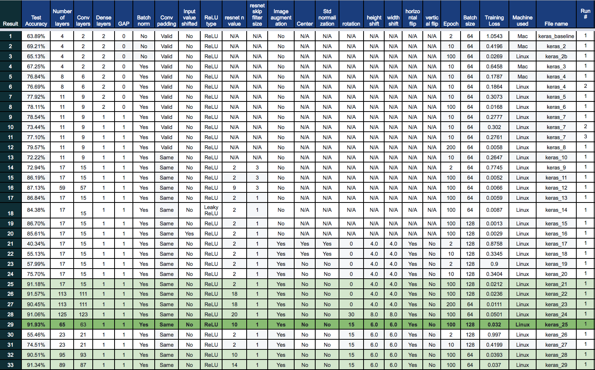

# Overview
CIFAR-10 is not an easy dataset to classify.  Back in 2011, it was believed that [it would be hard to go above 80%](http://karpathy.github.io/2011/04/27/manually-classifying-cifar10/).  Since then, technology has advanced and accuracy has been going up. In 2018, a paper was published in which the accuracy was listed as 98.52%.  Despite this, it is a still much harder dataset than MNIST for which reaching 90% accuracy is really easy. 
I wanted to see how difficult it is to hit a 90% plus mark and what kind of tricks I need to employ.  I started with a plain-vanilla convnet and continued tweaking with different type of techniques and architectures.  Eventually, I was able to hit 91.93% accuracy against the test dataset.  In this article, I would like to share techniques that I used.

# About CIFAR-10
CIFAR-10 is a dataset that is used to test and/or measure classification performance of a machine learning architecture for images.  The dataset consists of:

| Description | Number of images |
|---|---|
| Training set | 50000 |
| Test set | 10000 |
| Total | 60000 |

Each image is

| Attribute | Value |
|---|---|
| Height | 32 pixels |
| Width | 32 pixels |
| Channels | 3 |

Each image is classified into one of the 10 classes as listed in the [CIFAR-10 homepage](https://www.cs.toronto.edu/~kriz/cifar.html).

# Objectives
CIFAR-10 is not an easy dataset to classify.  [a Kaggle leaderboard in 2015](https://www.kaggle.com/c/cifar-10/leaderboard) shows 22 contestants beat 90% accuracy so I thought that 90% would be a good bar for me to target for now as trying to go for the state of art 98.52% accuracy number in a [2018 a paper](https://arxiv.org/abs/1805.09501) would be very difficult or require more resources/effort.

I also thought it would be fun to figure out what ML techniques are the icing on the cake vs stuff that makes a significant difference in terms of accuracy.  I made 33 attempts with 29 different scripts each with different configurations, some of which are small some of which are major.  I started with a plain-vanilla convnet and continued tweaking with different type of techniques and architectures.  Eventually, I was able to hit 91.93% accuracy against the test dataset.

Please see the Appendix for the names of each column.

## Phase 1. Two conv layer network

|Best result|69.21%|
|---|---|
|Result #|#1-#4|

I started off with a 2-conv layer and 2 dense layer architecture and got 63.89% which obviously is a very low result (Result #1).  I did a few more tries (keras_2 and keras_3 scripts) with this architecture and seeing that I wouldn't hit 90% and decided to add more conv layers.  At that point, I didn't even try with 100 epochs, and I tested the same architecture with 100 epochs later on (keras_2b) to write this post.  As I expected, accuracy against test data was 65.13% while training accuracy was 99.28% indicating a severe overfitting problem.

## Phase 2.  6 to 9 conv layer network

|Best result|79.57%|
|---|---|
|Result #|#5 - #13|

I increased the number of conv layers to 6, and eventually to 9 in this phase.  Though I was able to reach 79.57% accuracy with result #12, the script ran 200 epochs, so I didn't think that accuracy would go up much more.  I thought that I'd need a different approach.

## Phase 3. ResNet blocks without data augmentation

|Best result|87.13%|
|---|---|
|Result #|#14 - #20|

I got an idea to use ResNet when I was reading CycleGAN implementation code (https://github.com/leehomyc/cyclegan-1/blob/master/model.py).  I looked for [the original paper of ResNet](https://arxiv.org/abs/1512.03385).  Section 4.2 of the paper discussed their approach for CIFAR-10 in depth, and I decided to implement based on a subset of their approach. A subset means that I would use their network architecture, but not using their method of optimization, learning rate adjustment or data augmentation. 
As I haven't actually implemented ResNet in Keras, I also used [Keras team's ResNet implementation code](https://github.com/keras-team/keras-applications/blob/master/keras_applications/resnet50.py) as my reference. This gave me a boost that was close to 8%.

## Phase 4. ResNet blocks with data augmentation

|Best result|91.93%|
|---|---|
|Result #|#21 - #33|

In order to reach 90%, I decided to adopt data augmentation that was discussed in the paper which I skipped.  The paper discussed adding padding to the image to make it 40x40 pixels and randomly pick 32x32 pixels, but I decided to use [Keras's built-in data augmentation feature](https://keras.io/preprocessing/image/).  After realizing that enabling featurewise_center and featurewise_std_normalization don't work for this particular experiment, I turned it off and settled for horizontal & vertical offset, horizontal flip.  I didn't initially rotate the image, but switched to 15 degree-rotation towards the end. I was able to hit 91.93% in result #29 with the keras_25 script.  I wanted to hit the 92% mark, and tried a few more times, but I wasn't able to exceed this.

# Code
All the code is available in this repo(https://github.com/hideyukiinada/cifar10/tree/master/project)

# Appendix
## Note on column names

|Column name| Note|
|---|---|
|Result| Index number of the result|	
|Test Accuracy	| Number of correct predictions out of 10,000 images in test dataset|
|Number of layers| Total number of layers including conv layers, dense layers, a global average pooling layer|
|Conv layers	|Number of convolution layers|
|Dense layers|Number of dense layers (aka fully-connected layers)|
|GAP	|Global average pooling layer|
|Batch norm|Use of batch normalization|
|Conv padding|Type of padding used for conv-layers. Valid means no padding was used.  Same means padding was used.|
|Input value shifted|Whether to shift the input image value to center to 0 or not|
|ReLU type|Type of ReLU used in activation|
|ResNet n value|Each ResNet block contains two conv layers in the model used in this experiment. There is a three different types of ResNet used in the paper.  Namely 64 filter output block, 128 filter output block, 256 filter output block.  N value determines how many of each block was used.  For example, if n=2, then two 64 filter blocks, two 128 filter blocks, two 256 filter blocks will be used, which is 6 filter blocks or 12 conv layers for ResNet blocks. There is one additional conv layer that is applied to input, so the total number of conv layers is 1 + 6n. |
|resnet skip filter size| When you downsample feature map in a ResNet block, you also need to downsample and adjust the channel number of the shortcut connection.  This was done via a conv layer, and this column value shows whether the 1x1 kernel was used or 3x3 kernel was used|
|Image augmentation| Whether data augmentation was used or not|
|Center| featurewise_center.  Please refer to [Keras reference](https://keras.io/preprocessing/image/) |
|Std normalization| featurewise_std_normalization. Please refer to [Keras reference](https://keras.io/preprocessing/image/)|
|Rotation| Degrees of image rotation |
|Height shift| Range of horiozontal shift |
|Width shift| Range of vertical shift |
|Horizontal flip| Whether to randomly flip image horizontally or not|
|Vertical flip|Whether to randomly flip image vertically or not|
|Epoch|Number of epochs|
|Batch size|Size of each batch|
|Training Loss|Loss reported for the last batch of training|
|Machine used|Machine used for training and prediction|
|File name|Name of the script used|
|Run|Some scripts were run more than once, and this number indicates the number|

## Machines used
* Linux (OS: Ubuntu 18.10, RAM: 48 GB, CPU: 3.4 GHz Intel Core i5-7500, GPU: NVIDIA GeForce GTX 1080, Python: 3.6.7, TensorFlow-GPU: 1.12.0, Keras: 2.2.4)
* Mac (OS:10.13.5, RAM: 16 GB, CPU: 2.6 GHz Intel Core i5, Python: 3.6.7, TensorFlow: 1.12.0, Keras: 2.2.4)
